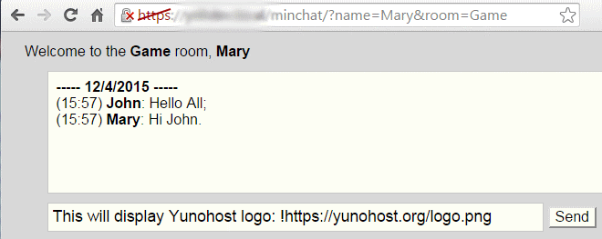

<!--
N.B.: This README was automatically generated by https://github.com/YunoHost/apps/tree/master/tools/readme_generator
It shall NOT be edited by hand.
-->

# Minchat pour YunoHost

[](https://dash.yunohost.org/appci/app/minchat)  

[](https://install-app.yunohost.org/?app=minchat)

*[Read this readme in english.](./README.md)*

> *Ce package vous permet d’installer Minchat rapidement et simplement sur un serveur YunoHost.
Si vous n’avez pas YunoHost, regardez [ici](https://yunohost.org/#/install) pour savoir comment l’installer et en profiter.*

## Vue d’ensemble

Minchat est une application de chat minimaliste. Elle est basé sur [wojtek77/chat](https://github.com/wojtek77/chat), elle-même basé sur [le tutoriel de Gabriel Nava](http://code.tutsplus.com/tutorials/how-to-create- une-simple-application-de-chat-basée sur le Web--net-5931).

### Caractéristiques

- Chat Web simple : nécessite uniquement un navigateur ; pas d'application XMPP.
- Pas besoin de s'inscrire pour les utilisateurs. J'ai juste besoin de l'adresse Web. Mais contrôle d'autorisation facultatif.
- À la connexion, la page est alimentée avec les messages du jour
- Les arguments sont dans l'URL en tant qu'arguments *get*, afin que vous puissiez partager l'URL ou en faire un favori pour éviter de remplir un formulaire.
Exemple : `https://__DOMAIN____PATH__/minchat/?room=Living&name=John`
- En option multi-pièces

**Version incluse :** 2017.05.30~ynh1

## Captures d’écran



## Documentations et ressources

* Dépôt de code officiel de l’app : <https://github.com/wojtek77/chat>
* YunoHost Store: <https://apps.yunohost.org/app/minchat>
* Signaler un bug : <https://github.com/YunoHost-Apps/minchat_ynh/issues>

## Informations pour les développeurs

Merci de faire vos pull request sur la [branche testing](https://github.com/YunoHost-Apps/minchat_ynh/tree/testing).

Pour essayer la branche testing, procédez comme suit.

``` bash
sudo yunohost app install https://github.com/YunoHost-Apps/minchat_ynh/tree/testing --debug
ou
sudo yunohost app upgrade minchat -u https://github.com/YunoHost-Apps/minchat_ynh/tree/testing --debug
```

**Plus d’infos sur le packaging d’applications :** <https://yunohost.org/packaging_apps>